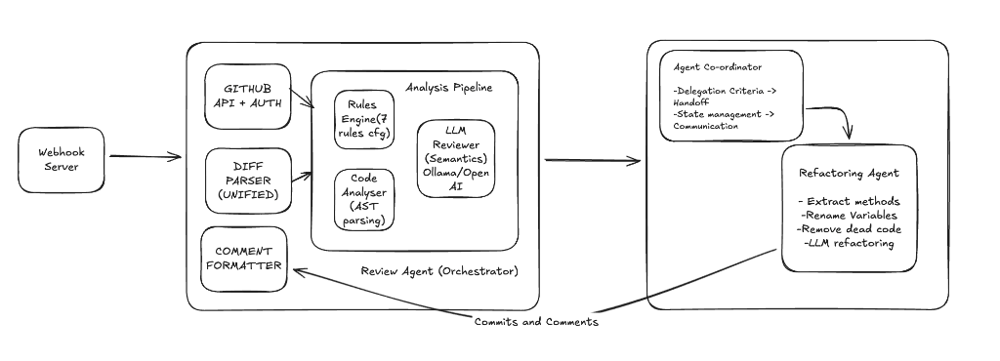

# 🤖 Automated Code Review Agent

An intelligent, automated code review system that integrates with GitHub's pull request workflow. It autonomously analyses code changes, provides actionable inline feedback, and delegates to a refactoring agent to apply automated improvements.

## 🏗️ Architecture



### Agent Communication Flow

```
Review Agent                    Coordinator                  Refactoring Agent
    │                               │                              │
    │  analyse PR files             │                              │
    │──────────────────►            │                              │
    │                               │                              │
    │  violations + findings        │                              │
    │◄──────────────────            │                              │
    │                               │                              │
    │  should_delegate(file, violations, complexity)                │
    │──────────────────────────────►│                              │
    │                               │                              │
    │                               │  delegation_request          │
    │                               │─────────────────────────────►│
    │                               │                              │
    │                               │      apply refactorings      │
    │                               │      commit to PR branch     │
    │                               │                              │
    │                               │  delegation_result           │
    │                               │◄─────────────────────────────│
    │                               │                              │
    │  post review + summary        │                              │
    │──────────────────►            │                              │
    │                               │                              │
```

## ✨ Features

### Baseline Code Review Agent

- **GitHub Integration**: Webhook-driven PR events via FastAPI, PAT authentication, rate limiting with retry logic
- **Inline Review Comments**: Comments attached directly to the diff lines using diff-position mapping (not fallback issue comments)
- **Diff Parsing**: Unified diff parsing with line-number-to-diff-position mapping for precise inline comment placement
- **7 Coding Standard Rules** (YAML-configurable):
  - 🎨 **Style**: Line length, naming conventions (PascalCase classes, snake_case functions)
  - ⚙️ **Quality**: Function complexity, unused imports
  - 🔒 **Security**: Hardcoded secrets, dangerous functions (`eval`, `exec`, `pickle.loads`, `subprocess` with `shell=True`)
  - ✅ **Best Practices**: Docstring coverage
- **Static Analysis**: AST-based nesting depth, mutable default arguments, parameter counts, bare `except` clauses, TODO/FIXME tracking, `print()` usage detection
- **LLM Semantic Review**: Deep analysis via OpenAI / Ollama / Anthropic
- **Resolution Tracking**: Each finding is marked `resolved: true/false` showing what the refactoring agent auto-fixed vs what still needs human attention
- **Observability**: JSON/JSONL output with confidence scores, rule reasoning, resolved status, and summary statistics

### Multi-Agent System

- **Agent Coordinator**: Manages handoffs between review and refactoring agents with full audit trail
- **Delegation Criteria**: High complexity (>10), many violations (>3/file), critical severity — all configurable
- **Refactoring Agent**: Automated fixes — rename variables to snake_case, remove unused imports, LLM-powered complex refactoring
- **Commit Back**: Refactoring agent commits changes directly to the PR branch with descriptive messages
- **Safety Mechanisms**: Content validation before committing (size check, syntax check via `ast.parse`), infinite loop prevention on webhook synchronize events
- **Communication Protocol**: Structured message passing with full audit trail (delegation_request → delegation_result)

## 🚀 Quick Start (< 5 minutes)

### 1. Clone & Install

```bash
git clone <repo-url>
cd automated-code-review
pip install -r requirements.txt
```

### 2. Configure Environment

```bash
cp .env.example .env
# Edit .env with your tokens:
#   GITHUB_TOKEN=ghp_your_token       (required for live PR reviews)
#   WEBHOOK_SECRET=your_webhook_secret (required for webhook verification)
#   LLM_PROVIDER=ollama               (default: ollama, also: openai, anthropic)
#   OLLAMA_URL=http://localhost:11434  (if using Ollama)
```

### 3. Run a Sample Review (No API Keys Needed)

```bash
python -m src.review_agent --dry-run --sample
```

This runs the full pipeline on built-in sample code containing intentional violations (hardcoded secrets, `eval()`, bad naming, etc.) and outputs results to `logs/`.

### 4. Review a Real PR

```bash
# Analyse a specific PR (posts review comments to GitHub)
python -m src.review_agent --repo owner/repo --pr 42

# Dry-run mode: analyse without posting comments
python -m src.review_agent --repo owner/repo --pr 42 --dry-run
```

### 5. Start the Webhook Server

```bash
python -m src.webhook_server
```

Configure your GitHub repo webhook to point to `http://your-server:5000/webhook` with `pull_request` events and your `WEBHOOK_SECRET`.

> **Tip:** Use [ngrok](https://ngrok.com/) for local development: `ngrok http 5000`

> **Bonus:** FastAPI auto-generates interactive API docs at `http://localhost:5000/docs`

## 📁 Project Structure

```
├── config/
│   └── coding_standards.yaml    # 7 configurable rules + delegation settings
├── src/
│   ├── __init__.py              # Package init
│   ├── github_client.py         # GitHub API wrapper (auth, PRs, commits, comments)
│   ├── diff_parser.py           # Unified diff parser with position mapping
│   ├── rules_engine.py          # YAML-driven rule checkers (7 rules)
│   ├── code_analyzer.py         # AST + pattern static analysis
│   ├── llm_reviewer.py          # Multi-provider LLM semantic review
│   ├── comment_formatter.py     # GitHub markdown formatting + summary
│   ├── review_agent.py          # Main orchestrator + CLI entry point
│   ├── refactoring_agent.py     # Automated refactoring + commit
│   ├── agent_coordinator.py     # Multi-agent handoff + state management
│   └── webhook_server.py        # FastAPI webhook endpoint
├── tests/
│   └── test_review_pipeline.py  # 36 tests covering all components
├── examples/
│   ├── sample_pr_review.json    # Real review output from test PR
│   └── sample_logs.jsonl        # JSONL log output
├── logs/                        # Runtime output (gitignored)
├── requirements.txt
├── setup.py
├── .env.example
├── .gitignore
└── README.md
```

## ⚙️ Configuration

Edit `config/coding_standards.yaml` to customise rules:

```yaml
rules:
  - id: STYLE_001
    name: line_length
    category: style_formatting
    severity: warning
    params:
      max_length: 120
    enabled: true

  - id: SECURITY_002
    name: no_dangerous_functions
    category: security
    severity: critical
    params:
      forbidden: [eval, exec, compile, __import__]
    enabled: true

delegation:
  max_violations_per_file: 3
  min_complexity_for_refactor: 10
  auto_refactor_severities: [critical, error]
  enabled: true
```

## 🧪 Running Tests

```bash
python -m pytest tests/test_review_pipeline.py -v
```

**36 tests** covering all components:

| Component         | Tests | Coverage                                                            |
| ----------------- | ----- | ------------------------------------------------------------------- |
| Diff Parser       | 5     | Hunks, line numbers, empty patches, context lines                   |
| Rules Engine      | 9     | All 7 checkers, filtering, non-Python skip, changed-line scope      |
| Code Analyzer     | 5     | Bare except, mutable defaults, nesting, parameters, print detection |
| Comment Formatter | 3     | Inline format, violation format, summary generation                 |
| Refactoring Agent | 4     | Import removal, naming fixes, action mapping, LLM fallback          |
| Agent Coordinator | 5     | Delegation criteria, handoff lifecycle, messaging                   |
| End-to-End        | 5     | Full pipeline, dry-run, file output, integration                    |

## 🔌 API Endpoints

| Endpoint   | Method | Description                             |
| ---------- | ------ | --------------------------------------- |
| `/health`  | GET    | Health check                            |
| `/webhook` | POST   | GitHub webhook receiver (HMAC-verified) |
| `/review`  | POST   | Manual review trigger                   |
| `/docs`    | GET    | Auto-generated OpenAPI documentation    |

### Manual Review API

```bash
curl -X POST http://localhost:5000/review \
  -H "Content-Type: application/json" \
  -d '{"repo": "owner/repo", "pr": 42}'
```

## 📊 Output Formats

### JSON — Full Review Result

```json
{
  "pr_metadata": { "number": 5, "title": "Add auth service", "author": "DevGuyWilly" },
  "total_issues": 40,
  "resolved_issues": 15,
  "unresolved_issues": 25,
  "violations": [
    {
      "rule_id": "SECURITY_001",
      "severity": "critical",
      "description": "Possible hardcoded secret detected.",
      "file_path": "app/auth_service.py",
      "line_number": 12,
      "resolved": true,
      "resolved_by": "general"
    }
  ],
  "findings": [
    {
      "finding_type": "complexity",
      "severity": "warning",
      "description": "Code is nested 6 levels deep.",
      "resolved": false
    }
  ],
  "delegation_actions": [...],
  "coordinator_report": { "total_handoffs": 1, "completed": 1, "failed": 0 }
}
```

### JSONL — Individual Findings (Streamable)

```json
{"rule_id": "SECURITY_001", "severity": "critical", "resolved": true, "source": "rules_engine", ...}
{"finding_type": "complexity", "severity": "warning", "resolved": false, "source": "static_analysis", ...}
```

### Console Output

```
======================================================================
  CODE REVIEW AGENT — ANALYSIS SUMMARY
======================================================================

  PR: #5 — Add authentication service module
  Total Issues: 40
  ✅ Resolved: 15  |  ❌ Unresolved: 25
  Elapsed: 410.5s

  📋 Rule Violations: 28
     ✅ [WARNING ] app/auth_service.py:15 — Function 'authenticateUser' does not follow snake_case
     ❌ [CRITICAL ] app/auth_service.py:12 — Possible hardcoded secret detected.

  🔍 Static Analysis: 12
     ❌ [WARNING ] app/auth_service.py:25 — Mutable default argument in '__init__'
     ✅ [WARNING ] app/auth_service.py:27 — Bare 'except:' clause
```

### Inline GitHub Review Comments

```
🔒 🔴 CRITICAL: Use of dangerous function 'eval()' detected.

💡 What to do: Avoid 'eval()'. Use safer alternatives like ast.literal_eval().

Current code:
  result = eval(f"db.execute('{query}')")

Rule: SECURITY_002 | Confidence: 95%
```

## 🏛️ Architectural Decisions

| Decision            | Choice                | Rationale                                                                     |
| ------------------- | --------------------- | ----------------------------------------------------------------------------- |
| Language            | Python                | Rich ecosystem, stdlib `ast` module, PyGithub library                         |
| LLM Integration     | Multi-provider        | Flexibility: OpenAI, Ollama (local/free), Anthropic                           |
| Rule System         | YAML config           | Easy customisation without code changes                                       |
| Static Analysis     | AST + Regex           | Zero external dependencies (tree-sitter as future option)                     |
| Multi-Agent         | Custom protocol       | Lightweight, clear handoff semantics, full audit trail                        |
| Webhook Server      | FastAPI + Uvicorn     | Async support, auto OpenAPI docs, Pydantic validation                         |
| Output              | JSON + JSONL          | Machine-readable, auditable, streamable                                       |
| Comment Placement   | Diff position mapping | Comments appear inline on the exact diff line, not as fallback issue comments |
| Resolution Tracking | Cross-referencing     | Each finding shows whether it was auto-fixed by the refactoring agent         |

## 🔐 Security

- All secrets managed via environment variables (`.env` file, gitignored)
- Webhook signature verification (HMAC SHA-256)
- GitHub API rate limit handling with exponential backoff retry
- Content validation before committing (prevents corrupted file writes)
- Infinite loop prevention (detects agent's own commits on `synchronize` events)
- No hardcoded credentials anywhere in the codebase

## 📋 Summary of Accomplishments

### What Was Built

- ✅ Full end-to-end code review pipeline with GitHub PR integration
- ✅ 7 configurable coding standard rules (YAML-driven)
- ✅ AST-based static analysis with pattern matching
- ✅ Multi-provider LLM semantic review (Ollama/OpenAI/Anthropic)
- ✅ Inline review comments with diff-position mapping
- ✅ Multi-agent delegation system (review agent → refactoring agent)
- ✅ Automated refactoring with commit-back to PR branch
- ✅ Resolution tracking (resolved/unresolved per finding)
- ✅ FastAPI webhook server with signature verification
- ✅ 36 automated tests passing
- ✅ Machine-readable output (JSON + JSONL)
- ✅ Live-tested with real PRs on GitHub

### Known Limitations

- LLM review requires a running Ollama instance or API key (falls back gracefully)
- Refactoring agent handles Python files only
- Single-file refactoring scope (no cross-file dependency analysis)
- Complex refactoring quality depends on LLM model capability
- Inline comments only for lines within the diff (others appear in summary)

### Planned Next Steps (with more time)

- **Verification Agent**: Run tests after refactoring to validate changes don't break anything
- **Rollback Capability**: Revert refactoring commits if tests fail
- **Test Coverage Analysis**: Detect low-coverage areas and generate test suggestions
- **Multi-Language Support**: Extend static analysis to JavaScript, TypeScript, Go via Tree-sitter
- **Caching Layer**: Cache LLM responses for identical code patterns to reduce latency
- **GitHub Actions Integration**: Package as a reusable GitHub Action for zero-infrastructure setup
- **Dashboard**: Web UI for reviewing analysis history and trends over time
- **Batch Comments**: Merge multiple findings on adjacent lines into grouped review threads
